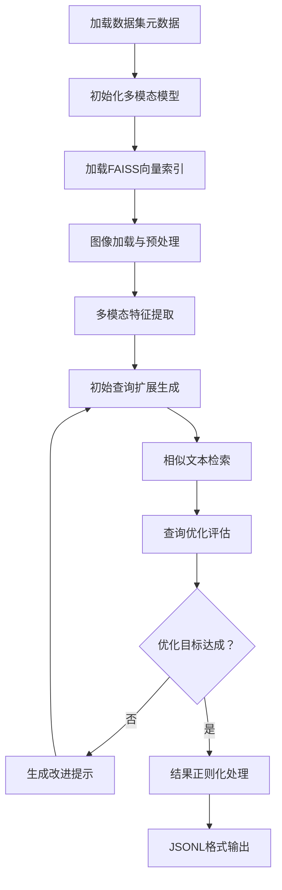

# 查询扩写与图像检索项目说明文档

## 1. 数据集描述

### 1.1. **数据集来源**  
   数据集使用公共数据集 Flickr30k（https://www.kaggle.com/datasets/hsankesara/flickr-image-dataset） 与 MS COCO（https://www.kaggle.com/datasets/awsaf49/coco-2017-dataset）

### 1.2 数据格式
Flickr30k
每条数据包含：
```json
{
    "image_id": "1234567.jpg",
    "captions": [
        "A man in a blue shirt is climbing a rock wall",
        "Someone is mountain climbing on an indoor wall",
        "A person in blue is climbing an indoor rock wall",
        "A man wearing blue is rock climbing indoors",
        "The man scales the indoor climbing wall"
    ]
}
```
MS COCO
每条数据包含：
```json
{
    "info": {
        "description": "COCO 2017 Dataset",
        "year": 2017,
        "version": "1.0",
        "contributor": "COCO Consortium"
    },
    // 其他数据
}
```

## 2. 模型选型
| 完整名称 | 参数量 | 架构类型 |
|----------|--------|----------|
|BLIP| 4.46亿 | Encoder-Decode |
|llava-v1.6-mistral-7b-hf| 70亿 | Decoder-Only |
|Llama-3.1-8B-Instruct| 80亿 | Decoder-Only |

---

## 3. 环境依赖

### 3.1 核心依赖包
```python
Python == 3.12.2
torch == 2.5.1
numpy == 1.26.4
transformers == 4.49.0
faiss == 1.9.0
tqdm == 4.66.5
torchvision == 0.20.1
matplotlib == 3.9.2
```

### 3.2 环境配置
#### 使用conda创建虚拟环境
```python
conda create -n re python=3.12 -y
conda activate re
```
---

## 4. 项目结构与运行
### 4.1 项目文件结构
```text
BLIP/
├── playground/
│   └── data/                  # 实验性数据目录
├── flickr30k/                 # Flickr30k 数据集
│   └── README.md              # Flickr30k 数据集说明
├── mscoco/                    # MS COCO 数据集
│   └── README.md              # MS COCO 数据集说明
├── README.md                   # 主项目文档
├── embed_image_as_faiss.py     # 图像嵌入FAISS索引脚本
├── multi_model_query_expansion.py          # 多模型查询扩展脚本
└── multi_model_query_expansion_mscoco.py   # COCO专用查询扩展脚本
```

### 4.2 Shell运行命令集
```bash
python multi_model_query_expansion_mscoco.py \
  --model_version "llava-v1.6-mistral-7b-hf" \
  --dataset_path "./data/mscoco/metadata.jsonl" \
  --image_dir "./coco/coco2017/" \
  --faiss_index "./checkpoints/m_query_expansion_faiss.index" \
  --output_dir "./mm_rewrite_res/" \
  --batch_size 8 \
  --max_length 512 \
  --temperature 0.7 \
  --top_p 0.9 \
  --start_idx 0 \
  --log_file "expansion_log.txt"
  --其他需要添加的参数
```

## 5. 实验设计

### 5.1 处理流程


### 5.2 关键技术
1. **数据预处理**：
   - 跨模态数据对齐处理：
     * 图像：尺寸归一化（448×448）与通道标准化（CLIP均值方差）
     * 文本：提示工程模板注入（如"详细描述这张图片：{原始查询}"）
   - 特征空间映射：
     * 视觉特征：ViT分层特征提取
     * 文本特征：动态分词与注意力掩码生成
     * 跨模态融合：特征拼接后层归一化

2. **训练配置**：
   - 多模态优化参数：
     * 图像：尺寸归一化（448×448）与通道标准化（CLIP均值方差）
     * 文本：提示工程模板注入（如"详细描述这张图片：{原始查询}"）
   - 资源约束方案：
     * 4-bit量化推理（QLoRA适配器）
     * 梯度检查点激活
     * FlashAttention-2加速
   - 收敛控制策略：
     * 早停监测：验证集CIDEr持续2轮无提升
     * 早停监测：验证集CIDEr持续2轮无提升

3. **评估方法**：
   - 检索效用：mAP@K（K=5,10,20）
   - 核心指标：
     * 检索效率增益：ΔRecall = 扩展后召回率 - 原始召回率

---

## 6. 结果与结论

### 6.1 性能对比

**表1：多轮优化对检索召回率的影响（%）**
| 循环轮次 | Recall@top5  | Recall@top10  | Recall@top15  | Recall@top20  |
|------|---------|-----------|-----------|---------|
| 1 | 61.05 | 63.78 | 71.42 | 78.53 |
| 2 | 67.12 | 69.82 | 75.41 | 81.97 |
| 3 | 68.49 | 71.89 | 77.03 | 83.51 |
| 4 | 69.13 | 73.71 | 79.90 | 84.23 |

**表2：多轮优化对F1score的影响（%）**
| 循环轮次 | F1score@top5  | F1score@top10  | F1score@top15  | F1score@top20  |
|------|---------|-----------|-----------|---------|
| 1 | 68.83 | 77.27 | 84.23 | 90.44 |
| 2 | 74.20 | 84.86 | 88.84 | 92.53 |
| 3 | 74.92 | 86.07 | 89.64 | 93.16 |
| 4 | 75.34 | 86.58 | 90.10 | 93.33 |

### 6.2 核心指标计算公式
$$
R^T = \frac{1}{N} \sum_{i=1}^{N} \left( \frac{\sum_{t=0}^{T} |\mathcal{L}_{r,i}^t|}{n_r^i} \right)
$$
